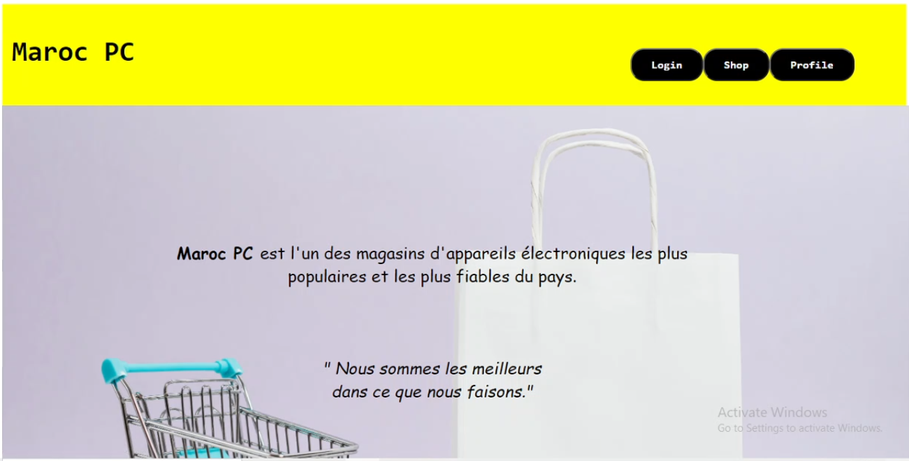

# MarocPC

Ecommerce website for a computer store, built using HTML, CSS, JavaScript and PHP.

  

  

 

---

### MarocPC 🥳 🚀

---

 

**[PROJECT PHILOSOPHY](https://github.com/babe-saleh-mahfoud/MarocPC#-project-philosophy) •
[WIKI](https://github.com/babe-saleh-mahfoud/MarocPC#-wiki) •
[TECH STACK](https://github.com/babe-saleh-mahfoud/MarocPC#-tech-stack) •
[CONTRIBUTING](https://github.com/babe-saleh-mahfoud/MarocPC#%EF%B8%8F-contributing) •
[SPREAD THE WORD](https://github.com/babe-saleh-mahfoud/MarocPC#-spread-the-word) •
[LICENSE](https://github.com/babe-saleh-mahfoud/MarocPC#%EF%B8%8F-license)**

 

# 🧐 Project philosophy

> MarocPC is an E-Commmerce website that let you loging, logout, browse inventory, make orders and so on .
> As an admin you can see inventory stats, clients stats, manage the database etc.

# 📒 Wiki

This project repository has [MarocPC](https://github.com/babe-saleh-mahfoud/MarocPC/wiki) (currently WIP) that you should consider reading! It goes into detail about the project from a more technical aspect. If you are interested in learning more about the app itself, go ahead and check it out!

# 👨‍💻 Tech stack

Here's a brief high-level overview of the tech stack the MarocPC app uses:

- This project uses [MySQL](https://www.mysql.com) for backend. MySQL is an open-source relational database management system (RDBMS).
  MySQL is free and open-source software under the terms of the GNU General Public License, and is also available under a variety of proprietary licenses
- for server-side scripting i used [PHP](https://www.php.net).

- For frontend, the app uses [HTML](https://en.wikipedia.org/wiki/HTML#:~:text=The%20HyperText%20Markup%20Language%20or,scripting%20languages%20such%20as%20JavaScript.),[CSS](https://en.wikipedia.org/wiki/CSS).

- The app uses the font ["Work Sans"](https://fonts.google.com/specimen/Work+Sans) as its main font, and the design of the app adheres to the material design guidelines.

For more information on the technologies that power the Well app, check out the [Tech Stack](https://github.com/chroline/well_app/wiki/Tech-Stack) page on our wiki.

# ✍️ Contributing

Interested in contributing to the Well app project? Thanks so much for your interest! We are always looking for improvements to the project and contributions from open-source developers are greatly appreciated.

If you have a contribution in mind, please check out our [Contribution Guide](https://github.com/chroline/well_app/wiki/Contribution-Guide) for information on how to do so. Also, make sure you read our [Code of Conduct](https://github.com/chroline/well_app/wiki/Code-of-Conduct) to foster an encouraging sense of community.

# 🌟 Spread the word!

If you want to say thank you and/or support active development of the Well app:

- Add a GitHub Star to the project!
- Connect me on Linkedin about!
  [Babe Saleh Mahfoud](https://www.linkedin.com/in/babe-saleh-mahfoud-519b52200/).

# ⚠️ License

The Well app is free and open-source software licensed under the GNU General Public License v3.0. All designs were created by [Cole Gawin](https://github.com/chroline) and distributed under Creative Commons license (CC BY-SA 4.0 International).

 

---

 

# 💛
